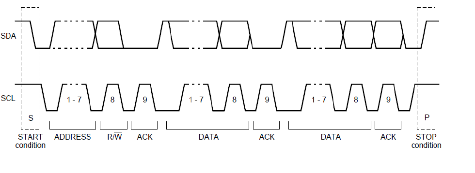

# Brief note

## Cấu trúc

1. Application (ASW)
2. RTE (RTOS,...)
3. Base Software (BSW)
   1. Service Layer
   2. ECU Abstraction layer
   3. CCD
   4. MCAL
4. MCU

## Config GPIO

```c
// Configure Clock Pulse for port GPIOC
RCC_APB2PeriphClockCmd(RCC_APB2Periph_GPIOC, ENABLE);

GPIO_InitTypeDef gpio;

// Setup GPIO (more detail in beblow description)
gpio.GPIO_Pin = GPIO_Pin_13;
gpio.GPIO_Speed = GPIO_Speed_2MHz;
gpio.GPIO_Mode = GPIO_Mode_Out_PP;

GPIO_Init(GPIOC, &gpio);
```

Source Code GPIO Init structure definition:

```c
/** 
  * @brief  GPIO Init structure definition  
  */

typedef struct
{
  uint16_t GPIO_Pin;             /*!< Specifies the GPIO pins to be configured.
                                      This parameter can be any value of @ref GPIO_pins_define */

  GPIOSpeed_TypeDef GPIO_Speed;  /*!< Specifies the speed for the selected pins.
                                      This parameter can be a value of @ref GPIOSpeed_TypeDef */

  GPIOMode_TypeDef GPIO_Mode;    /*!< Specifies the operating mode for the selected pins.
                                      This parameter can be a value of @ref GPIOMode_TypeDef */
}GPIO_InitTypeDef;

```

## Dio Channel

Setup pin mode (input or output, pull up or pull down)

Setup pin write output (high or low)

setup pin read

## Ngắt (Interrupt)

Program Counter (PC) là bộ đếm bước nhảy của vi điều khiển.

Stack pointer: đang chạy trong hàm main, xảy ra hàm ngắt, thì chương trình sẽ chuyển qua hàm ngắt để xử lý, lúc này địa chỉ của dòng lệnh cũ sẽ được lưu lại trong Stack Pointer, để sau khi chạy ngắt xong, chương trình lấy trong Stack Pointer này ra để chạy tiếp.

### Ngắt ngoài

là giá trị của chân vi điều khiển bị thay đổi. Có 4 chế độ ngắt trong các vi điều khiển:

 - LOW: chân của vi điều khiển từ cao xuống thấp -> ngắt
 - HIGH: chân của vi điều khiển từ thấp lên cao -> ngắt
 - RISING: khó giải thích quá ta.
 - FALLING

### Ngắt timer


### Ngắt truyền thông


## Software SPI

## Hardware SPI

## Software I2C


## Hardware I2C

# UART
Những thông tin cần lưu ý, tốc độ baudrate, bit chẳn lẽ. 

## BAUDRATE
là trong 1s truyền được bao nhiêu bit, từ đó tính được timer sử dụng để ngắt truyền data.


## bit chẳn lẽ 

## Controller Area Network (CAN) 


- 1 bit SOF: Start of Frame (default dominant - 0 - LOW)

### Arbitraction Field:

- 11 bit ID
- 1 bit Remote Transmit Request (RTR), phân biệt remote frame và data frame 
  - Nếu RTR là dominant (0 - LOW) thì là data frame - truyền data giữa 2 MCUs (VDP: MCU muốn truyền dữ liệu đến 1 con MCU khác).
  - Nếu RTR là recesive (1 - HIGH) thì là remote frame - điều khiển MCU khác (VD: MCU điều khiển tốc độ của động cơ).

### Control Field:

- Bit IDE (Identifier Extension) - [Must be dominant (0) for base frame format with 11-bit identifiers](https://www.wikiwand.com/en/CAN_bus)

Bit phân biệt khung chuẩn IDE = 0 (default frame) hay là khung mở rộng IDE = 1 (extended frame).

Khung chuẩn với khung mở rông:
Khung chuẩn ít thông tin (bật tắt động cơ), khung mở rộng (nhiều thông số hơn)

- Bit r0: Để làm gì ta??? (thường là dominant)
- 4 Bit Data Length Code (DLC): Quy định độ dài trường data (Data Length). VD: Data length là 8 bytes thì trường này sẽ là 1000(BIN). Còn nếu trường Data Length là 7 bytes thì DLC sẽ là 0111(BIN).

### Data Field (0 - 8 bytes)

Trường chứa dữ liệu được quy định bởi DLC.

### Cyclic Redundancy Check Field – CRC (15 bits checksum, 1 bit đệm)

Sử dụng thuật toán check sum để chuyển trường data field 8bytes thành 16 bít kiểm tra. (NOTE)

TẠI SAO LẠI CHIA RA 2 BIT NHƯ THẾ NÀY LÀM GÌ????

- 1 bit Acknowledge Field – ACK
- 1 bit Acknowledge Field – ACK Delimiter

### End Of Frame EOF
- 7 bit End Of Frame (EOF)

## Cách trả lời phỏng vấn giao thức CAN

Cách đấu nối, cấu tạo

CAN HIGH, CAN LOW

Ưu tiên, không ưu tiên

Dataframe

## Các thông số của CAN

```c
// Xem trong file gốc để biết chi tiết hơn

// Time Triggered Communication Mode - Set 1 khoảng thời gian sẽ gửi data.
CAN_InitStructure.CAN_TTCM = DISABLE; 

// Automatic Bus-Off Management - Nếu gửi data lỗi thì nó sẽ tiếp tục gửi tiếp (DISABLE). Còn ENABLE thì nó sẽ gửi lại đoạn data lại từ đầu.
CAN_InitStructure.CAN_ABOM = DISABLE; 

// Automatic Wake-Up Mode - Tự động thức (wake-up), sẽ có một hàm trả về cờ, nếu cờ đó là 0 thì tự động đánh thức vdk.
CAN_InitStructure.CAN_AWUM = DISABLE; 

// No-Automatic Retransmission mode - Nếu truyền nhận nhận được bit ACK - thì chế độ này sẽ truyền lại dữ liệu.
CAN_InitStructure.CAN_NART = DISABLE;

// Receive FIFO Locked mode - Có/Không tạo hàng đợi cho dữ liệu (trong này có thêm 2 chế độ nữa).
CAN_InitStructure.CAN_RFLM = DISABLE;

// Transmit FIFO Priority - ENABLE thì độ ưu tiên truyền dữ liệu tùy thuộc vào FIFO, DISABLE thì độ ưu tiên phụ thuộc vào ID của gói dữ liệu CAN. 
VD: có 2 ID `txMessage.stdID = 0x03;` và `txMessage.stdID = 0x01;`. và `0x03` truyền dữ liệu trước 0x01.
  - DISABLE thì nó sẽ phụ thuộc vào lời gọi trước (0x03) thì nó sẽ gửi trước.
  - ENABLE  thì nó sẽ phụ thuộc vào ID, thì lúc này dù gọi sau 0x03 nhưng dữ liệu 0x01 mới gửi đi trước.

CAN_InitStructure.CAN_TXFP = DISABLE;

// Có 4 chế độ
CAN_InitStructure.CAN_Mode = CAN_Mode_Normal;

// 
#define CAN_Mode_Normal             ((uint8_t)0x00)  /*!< normal mode */

// Khi message gửi đi thì có thể đọc lại dữ liệu gửi đi (dùng để debug). NOTE: đọc lại dữ liệu nhờ vào phần cứng, Tx -> receiver -> controller -> Rx.
#define CAN_Mode_LoopBack           ((uint8_t)0x01)  /*!< loopback mode */

// Chỉ nhận data từ các node khác
#define CAN_Mode_Silent             ((uint8_t)0x02)  /*!< silent mode */

// Chỉ nhận dữ liệu và dữ liệu đó cố thể debug được.
#define CAN_Mode_Silent_LoopBack    ((uint8_t)0x03)  /*!< loopback combined with silent mode */

/* CAN Baudrate = 1MBps*/
// Tìm hiểu Time Quanta (TQ) - Đọc tài liệu để biết nhiều hơn.
CAN_InitStructure.CAN_SJW = CAN_SJW_1tq; // Thời gian đồng bộ giữa các node trong mạng.
CAN_InitStructure.CAN_BS1 = CAN_BS1_3tq; // Thời gian trễ đầu.
CAN_InitStructure.CAN_BS2 = CAN_BS2_5tq; // Thời gian trễ sau.

// 
CAN_InitStructure.CAN_Prescaler = 4;

CAN_Init(CAN1, &CAN_InitStructure);

// Bộ lọc ID (default = 0), có 0 - 13 bộ lọc
CAN_FilterInitStructure.CAN_FilterNumber = 0;

// Kiểm tra ID có đúng không, nếu đúng thì cho truyền/nhận
#define CAN_FilterMode_IdMask       ((uint8_t)0x00)  /*!< identifier/mask mode */

// Lưu nhiều ID khác nhau, nếu 1 node muốn nhận dữ liệu từ nhiều node khác.
#define CAN_FilterMode_IdList       ((uint8_t)0x01)  /*!< identifier list mode */
CAN_FilterInitStructure.CAN_FilterMode = CAN_FilterMode_IdMask; 

CAN_FilterInitStructure.CAN_FilterScale = CAN_FilterScale_32bit; // ID gồm 32-bit, VD: 0x12345678
CAN_FilterInitStructure.CAN_FilterIdHigh = 0x0000; // Thì nếu ID như VD trên thì IdHigh = 0x1234 - dành cho nhận.
CAN_FilterInitStructure.CAN_FilterIdLow = 0x0000; // IdLow = 0x5678 - dành cho nhận.

// Đọc mặt nạ bit trong C.
CAN_FilterInitStructure.CAN_FilterMaskIdHigh = 0x0000;
CAN_FilterInitStructure.CAN_FilterMaskIdLow = 0x0000;

CAN_FilterInitStructure.CAN_FilterFIFOAssignment = CAN_FIFO0;
CAN_FilterInitStructure.CAN_FilterActivation = ENABLE;
CAN_FilterInit(&CAN_FilterInitStructure);
```
